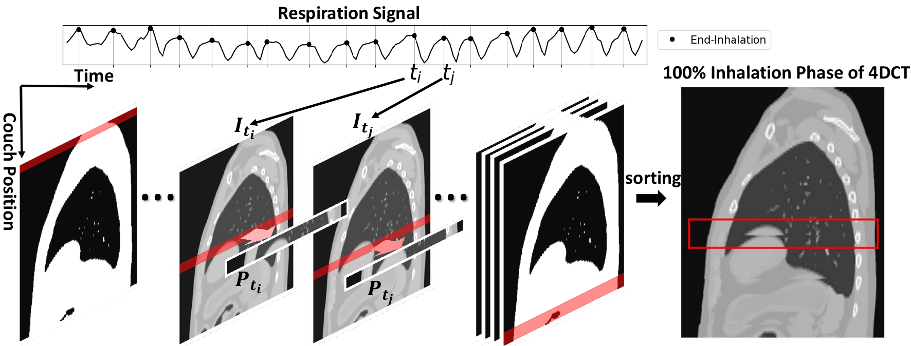

# MICCAI2024: Resolving Variable Respiratory Motion From Unsorted 4D Computed Tomography [[paper link](https://link.springer.com/chapter/10.1007/978-3-031-72378-0_55)]

[Yuliang Huang](https://scholar.google.com/citations?user=1fe-_aoAAAAJ&hl=en), 
[Bjoern Eiben](https://scholar.google.com/citations?user=RIDywa4AAAAJ&hl=en),
[Kris Thielemans](https://scholar.google.co.uk/citations?user=Y1AdYQEAAAAJ&hl=en), 
[Jamie McClelland](https://scholar.google.co.uk/citations?user=IrDaFHEAAAAJ&hl=en)

[![CC BY-NC-ND 4.0][cc-by-nc-nd-shield]][cc-by-nc-nd]

This repository provides pre-compiled executable along with the XCAT phantom dataset* used in our MICCAI paper. We propose surrogate-free/optimized method as an improvement over the surrogate-driven motion model approach ([Jamie McClelland et al.](https://doi.org/10.1088/1361-6560/aa6070)), as we found the quality of surrogate signals can impact accuracy of motion estimation ([Yuliang Huang et al.](https://doi.org/10.1088/1361-6560/ad1546)). The implementation was adapted from our original software [SuPReMo](https://github.com/UCL/SuPReMo). Keep en eye on this repo as we may incorpoarte the latest developments back to SuPReMo in the future.

<span style="font-size:0.85em;">*Thanks Prof Paul Segars from Duke University for the permission of releasing this single simulation example. Please contact him if you want to use the XCAT software.</span>

## Citation
Please cite our paper if you find this repository useful for your research
```bib
@inproceedings{huang2024resolving,
  title={Resolving Variable Respiratory Motion From Unsorted 4D Computed Tomography},
  author={Huang, Yuliang and Eiben, Bjoern and Thielemans, Kris and McClelland, Jamie R},
  booktitle={International Conference on Medical Image Computing and Computer-Assisted Intervention},
  pages={588--597},
  year={2024},
  organization={Springer}
}
``` 

## 4DCT sorting artefacts explained

Time points of the end-inhalation phase are identified as black dots in the respiration signal plot, with two of them being $t_i$ and $t_i$. $I_{t_i}$ and $I_{t_j}$ are the real-time volumes at $t_i$ and $t_j$ respectively. $P_{t_i}$ and $P_{t_j}$ indicate the CT segments acquired at the couch positions corresponding to $t_i$ and $t_i$, which are stacked into the final end-inhalation phase image. Artefact of duplicated diaphragm can be observed in the end-inhalation phase image

## XCAT phantom simulation dataset

Please visit [this link](https://doi.org/10.5522/04/26132077.v1) to access the phantom dataset. Alternatively, you could also download it with the following commands:
```bash
wget -O data.zip https://rdr.ucl.ac.uk/ndownloader/articles/26132077/versions/1?folder_path=data
```
After downloading the dataset, please extract the compressed folder by running:
```bash
unzip data.zip -d ./
```

The phantom dataset consisted of images at 182 timepoints, each with size 355x280x115 voxels and resolution of 1x1x3mm. The dynamic volumes can be found in [data/ground_truth/volumes.zip](./data/ground_truth/volumes.zip). Tumor masks for each volume can be found in [data/ground_truth/tumor_masks.zip](./data/ground_truth/tumor_masks.zip).

The [data/timeIndicesPerSliceAndPhase.txt](./data/timeIndicesPerSliceAndPhase.txt) file records the index of timepoint per slice and phase to simulate a realistic 4DCT acquisition pattern. Run the following lines to extract the CT slabs acquired at each timepoint and sort them into 10 respiration phases:

```bash
unzip data/ground_truth/volumes.zip -d data/ground_truth/volumes
unzip data/ground_truth/tumor_masks.zip -d data/ground_truth/tumor_masks
python generateData.py
```
The script above will generate two folders that contain 182 CT slab images (<b>data/unsort_ct_slabs/</b>) and 10 phase sorted 4DCT (<b>data/sorted_4dct/</b>). A text file (<b>data/dynamic_image_files.txt</b>) will also be generated to store the path to each CT slab images, which will later be used by our software.

You can visualize the results by running the following command line and checking the output phantom_animation.gif image:
```bash
python plot_phantom_images.py
```

## Prepare surogate files
The simulated RPM signal is stored in <b>data/rpm_signal.txt</b>. The following script will generate surrogate signals to be used by surrogate-driven/optimized method from the RPM signal (<b>data/surrogate_rpm_grad.txt</b>) and sinusoidal surrogate siginals to be used as initial values for surrogate-free method, derived from respiration phase (<b>data/surrogate_phase_derived.txt</b>).
```bash
python generate_surrogate_signals.py
```

## Surrogate-driven Motion Model
When respiration curves used to sort the 4DCT data are available and have strong correlation with internal motion, the surrogate-driven method can be used. In this phantom dataset, however, the rpm signal is not ideal because of the artificially created hysteresis in the simulated breathing motion.

Run the following script to fit the sorrugate-driven motion model and estimate the volumes and tumor masks at each timepoint:
```bash
bash run_surrogate_driven_method.sh
```
To evaluate the results of surrogate-driven method, run the following lines:
```bash
python evaluation.py --dir_gtVolume data/ground_truth/volumes/ --dir_gtMask data/ground_truth/tumor_masks/ --dir_estimatedVolume output/surr_driven/estimated_volumes/ --dir_estimatedMask output/surr_driven/estimated_tumormasks/
```

## Surrogate-free Motion Model
In clinical practice, the respiration curves are rarely saved. In such case, surrogate-driven method is not applicable due to the lack of surrogate signals. In contrast, surrogate-free method does not require existing respiration signals but optimize the surrogate signals from simple sinusoidal curves.

Run the following script to fit the sorrugate-free motion model and estimate the volumes and tumor masks at each timepoint:
```bash
bash run_surrogate_free_method.sh
```
To evaluate the results of surrogate-free method, run the following lines:
```bash
python evaluation.py --dir_gtVolume data/ground_truth/volumes/ --dir_gtMask data/ground_truth/tumor_masks/ --dir_estimatedVolume output/surr_free/estimated_volumes/ --dir_estimatedMask output/surr_free/estimated_tumormasks/
```

## Surrogate-optimized Motion Model
When clinical respiration curves are available, we don't need to be too harsh to ourselves by starting from sinusoidal functions. Instead, the surrogate-optimized method adjusts the clinical respiration surrogates when fitting the motion model, so as to enhance its correlation with the internal motion.

Run the following script to fit the sorrugate-optimized motion model and estimate the volumes and tumor masks at each timepoint:
```bash
bash run_surrogate_optimized_method.sh
```
To evaluate the results of surrogate-optimized method, run the following lines:
```bash
python evaluation.py --dir_gtVolume data/ground_truth/volumes/ --dir_gtMask data/ground_truth/tumor_masks/ --dir_estimatedVolume output/surr_optimized/estimated_volumes/ --dir_estimatedMask output/surr_optimized/estimated_tumormasks/
```

## Acknowledgement
This study was funded by Elekta Ltd., Crawley and the EPSRC-funded UCL Center for Doctoral Training in Intelligent, Integrated Imaging in Healthcare (i4health) (EP/S021930/1). We thank Dr. Gareth Price from the Christie NHS, University of Manchester, UK for providing data from ROSS-LC clinical trial.

This work is licensed under a
[Creative Commons Attribution-NonCommercial-NoDerivs 4.0 International License][cc-by-nc-nd].

[![CC BY-NC-ND 4.0][cc-by-nc-nd-image]][cc-by-nc-nd]

[cc-by-nc-nd]: http://creativecommons.org/licenses/by-nc-nd/4.0/
[cc-by-nc-nd-image]: https://licensebuttons.net/l/by-nc-nd/4.0/88x31.png
[cc-by-nc-nd-shield]: https://img.shields.io/badge/License-CC%20BY--NC--ND%204.0-lightgrey.svg
